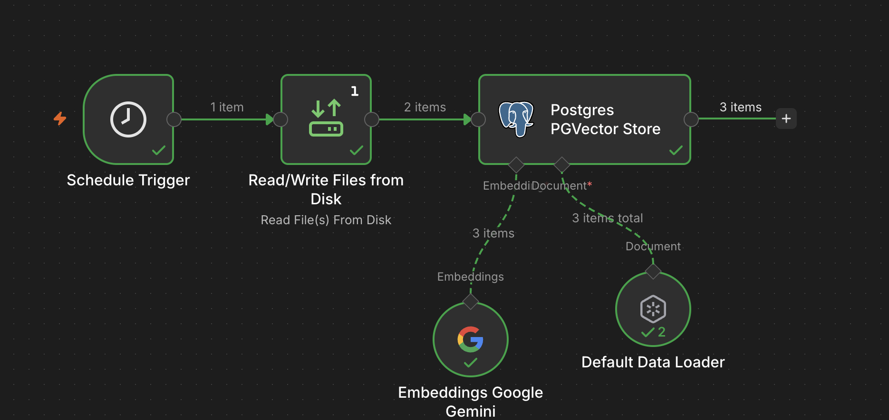

# n8n RAG Stack

Stack de automatización con n8n, PostgreSQL, PGVector y pgAdmin, orientado a flujos RAG (Retrieval-Augmented Generation) con embeddings de Gemini.

## Diagrama del flujo



---

## Servicios

| Contenedor | Imagen | Puerto host | Descripción |
|---|---|---|---|
| `n8n_app` | n8nio/n8n:latest | `5678` | Motor de automatización |
| `postgres_db` | postgres:16 | `5433` | Base de datos principal de n8n |
| `pgvector` | pgvector/pgvector:pg17 | `5434` | PostgreSQL con extensión vectorial |
| `pgadmin_ui` | dpage/pgadmin4 | `5050` | UI de administración de bases de datos |

Todos los servicios corren en la red Docker `postgres_network`.

---

## Levantar el stack

```bash
docker compose up -d
```

Verificar estado:

```bash
docker compose ps
```

Detener:

```bash
docker compose down
```

---

## Accesos

### n8n
- URL: http://localhost:5678
- Usuario: `admin`
- Contraseña: `admin`

### pgAdmin
- URL: http://localhost:5050
- Email: `admin@admin.com`
- Contraseña: `admin`

### PostgreSQL (postgres_db)
| Campo | Valor |
|---|---|
| Host externo | `localhost:5433` |
| Host interno Docker | `postgres:5432` |
| Usuario | `postgres` |
| Contraseña | `postgres` |
| Base de datos | `postgres` |

### PGVector
| Campo | Valor |
|---|---|
| Host externo | `localhost:5434` |
| Host interno Docker | `pgvector:5432` |
| Usuario | `postgres` |
| Contraseña | `postgres` |
| Base de datos | `postgres` |

---

## Base de datos RAG

- Servidor: `pgvector`
- Base de datos: `rag_db`
- Modelo de embeddings: `gemini-embedding-001` (3072 dimensiones)

### Estructura de la tabla `documents`

```sql
CREATE TABLE documents (
  id        SERIAL PRIMARY KEY,
  content   TEXT,
  metadata  JSONB,
  embedding VECTOR(3072)
);
```

> Sin índice por limitación de pgvector (máximo 2000 dimensiones para índices ivfflat/hnsw con tipo `vector`). Para datasets grandes considerar migrar a `halfvec(3072)` con índice `hnsw`.

### Recrear la tabla

```sql
DROP TABLE IF EXISTS documents;
CREATE TABLE documents (
  id        SERIAL PRIMARY KEY,
  content   TEXT,
  metadata  JSONB,
  embedding VECTOR(3072)
);
```

### Activar extensión vector (si es una BD nueva)

```sql
CREATE EXTENSION IF NOT EXISTS vector;
```

---

## Configuración n8n — Nodo PGVector Store

| Campo | Valor |
|---|---|
| Host | `pgvector` |
| Port | `5432` |
| Database | `rag_db` |
| Usuario | `postgres` |
| Contraseña | `postgres` |
| Table Name | `documents` |
| Content Column | `content` |
| Embeddings | Gemini `gemini-embedding-001` |

---

## Lectura y escritura de archivos desde n8n

Los archivos accesibles desde n8n se montan en:

| Ruta Mac | Ruta en contenedor |
|---|---|
| `~/n8n_test/files/` | `/home/node/.n8n-files/` |

En los nodos de n8n usar la ruta interna:

```
/home/node/.n8n-files/nombre-archivo.ext
```

Variables de entorno configuradas en el contenedor n8n:

```
N8N_DEFAULT_BINARY_DATA_MODE=filesystem
N8N_ALLOW_FILE_ACCESS_TO_PATHS=/home/node/.n8n-files
```

---

## Estructura del proyecto

```
n8n_test/
├── docker-compose.yml
├── files/                  # Archivos accesibles desde n8n
├── pgadmin/
│   ├── servers.json        # Servidores pre-registrados en pgAdmin
│   └── pgpass              # Contraseñas para conexión automática
└── README.md
```

---

## Notas importantes

- Desde dentro de los contenedores Docker usar siempre el nombre del servicio como host (ej: `pgvector`, `postgres`), nunca `localhost`.
- pgAdmin carga `servers.json` solo en el primer arranque (sin volumen previo). Si se necesita resetear: `docker compose stop pgadmin && docker compose rm -f pgadmin && docker compose up -d pgadmin`.
- El límite de pgvector 0.8.x para índices es 2000 dimensiones. Con `gemini-embedding-001` (3072 dims) la tabla funciona sin índice.
